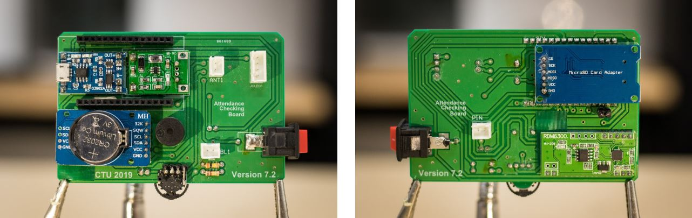
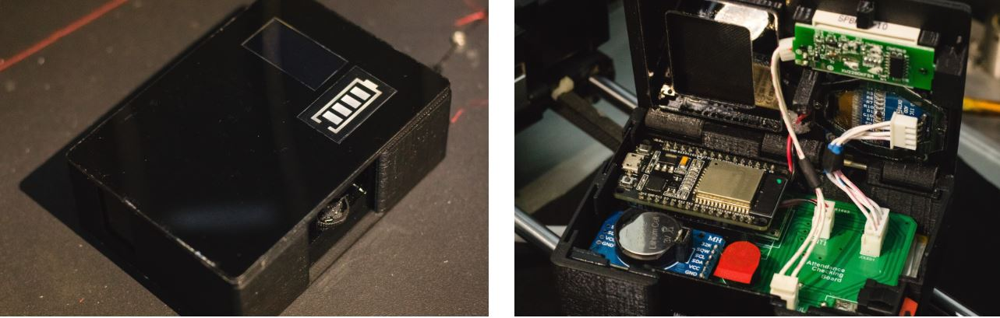

# Attendance Checking System for students of Can Tho University

[](https://github.com/minhan74/Card_Scanner/releases/latest)
[](https://github.com/minhan74/Card_Scanner/releases/latest/)
[](LICENSE) <!-- [](LICENSE) -->
[](https://github.com/minhan74/Card_Scanner/)

## Download

```bash
git clone --recursive https://github.com/minhan74/Card_Scanner.git
git submodule update --init --recursive
```

This project aims to create a portable device that is used to check student attendance based on their student ID card.

This project includes two main components:

* A Card Reader Device
* A Web Server

## Card Reader Device

This device is designed for reading student card, indicates student information and save these information into SD card. The device can connect to a server (locally or globally) to manipulate student's attendance information.

### Hardware

#### PCB

Designed in Altium 18.

Manufactured in china.



#### Cover

Designed using Fusion360.

Created by 3D printing and laser cutting.



### Embedded software

Microcontroller: ESP32 DEV KIT V1

Peripherals: RDM6300 RFID reader, RTC module, SD card reader, 3-state button, voltage converter, lipo battery, lipo charger.

Run on both core of an ESP32 using FreeRTOS. Compiled by ESP-IDF with Arduino core as a component.

* ESP-IDF version: 3.2
* Compiler version: 5.2.0
* Arduino components version: 1.0.2

## Web Server

Written in PHP 7.4.6

Based on:

* Xampp v7.4.6
* Lavarel framework 5.6.22

## Documentation

* **[Full Report]**: detailed explaination on how we create this system and how to use it (school scientific research report - in Vietnamese).
* **[Hardware assembling instruction]**: how to re-create the hardware (extracted from the full report - in Vietnamese).
* **[Hardware files]**: ready-to-print parts of the cover and PCB.
* **[ESP32 - How to use the device]**: Guidance on how to properly setup the device for usage (extracted from the full report - in Vietnamese).
* **[ESP32 - Flash Instruction]**: Instruction on how to flash a ready-to-use binary file to esp32 (in English).
* **[ESP32 - Prepare Developing Environment]**: Guidance on how to prepare an appropriate developing environment for esp32 (in English).
* **[Web server - How to use]**: How to use the web server (in Vietnamese).
* **[Web server - Create localhost server]**: How to create a localhost server for locally use (in Vietnamese).
* **[Web server - Create globalhost server]**: How to create a globalhost server for internet use (in Vietnamese).

## Sponsor by

* Msc. Khac-Nguyen Nguyen, Can Tho University. <nknguyen@ctu.edu.vn>
* Can Tho University school scientific research fund.

## Supervised by

* Assoc. Prof. Chi-Ngon Nguyen, Can Tho University. <ncngon@ctu.edu.vn>
* Dr. Chanh-Nghiem Nguyen, Can Tho University. <ncnghiem@ctu.edu.vn>
* Msc. Khac-Nguyen Nguyen, Can Tho University. <nknguyen@ctu.edu.vn>

## Credited

* Mr. Quang-Thong Duong-Pham was responsible for PCB design, product testing and reporting.
* Mr. Quang-Nhut Tran was responsible for web server development.
* Mr. Anh-Khoi Tran was responsible for database and web server improving.
* Mr. Minh-An Dao was responsible for embedded software development.

 (c) 2019 Quang-Thong Duong-Pham <baronvn7197@gmail.com> - Quang-Nhut Tran <nhut1202@gmail.com> - Anh-Khoi Tran <khoitrananh.20@gmail.com> - Minh-An Dao <minhan7497@gmail.com> - Can Tho University.

<!-- Links -->
[Full Report]:/notavailable_yet
[Hardware assembling instruction]:/docs/[Hardware]How_to_assemble.pdf
[Hardware files]: /hardware/
[ESP32 - How to use the device]:/docs/[ESP32]How_to_use_device.pdf
[ESP32 - Flash Instruction]: /docs/[ESP32]flash_ready-to-use_binary.md
[ESP32 - Prepare Developing Environment]: /docs/[ESP32]prepare_developing_environment.md
[Web server - How to use]: /docs/[Web_server]How_to_use_web_server.md
[Web server - Create localhost server]: /docs/[Web_server]Create_localhost_server.md
[Web server - Create globalhost server]:[Web_server]Create_globalhost_server.md
