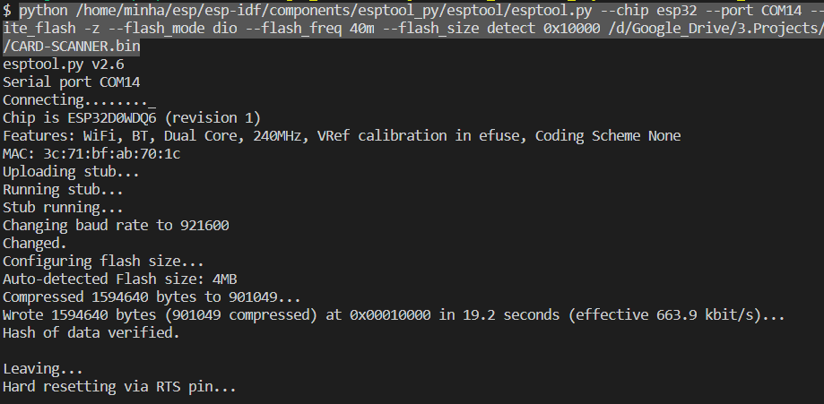

# FLASH READY-TO-USE ESP32 BINARY (IN WINDOWS)

## Step 0: download [esptool]

You can skip this step if you already install the developing environment

## Step 1: Open mingw32.exe (if developing env is installed) or cmd (if install only esptool)

- Locate to the project folder (/esp32), you should see the file _CARD-SCANNER.bin_
- Plug in your esp32, determine the port name (COM5, COM14, ...)
- Download the binary file to the esp32:

```bash
python /<esptool directory>/esptool.py --chip esp32 --port COM14 --baud 921600 --before default_reset --after hard_reset write_flash -z --flash_mode dio --flash_freq 40m --flash_size detect 0x10000 /<project_directory>/CARD-SCANNER.bin
```

- Change the directory to your appropriate situation. Successfully uploaded program will look something like this:

  

[esptool]: https://github.com/espressif/esptool