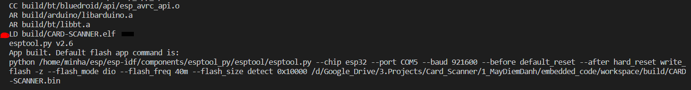

# PREPARE ESP-IDF PROGRAMMING ENVIRONMENT FOR ESP32

## Step 1: Download the environment – MSYS32

- Go to: <https://dl.espressif.com/dl/esp32_win32_msys2_environment_and_gcc8_toolchain-20191220.zip>
- Download the latest Windows all-in-one toolchain & MSYS2 zip file (~600mb)
- UNRAR the zip file in C:/
- Done setting up the pre-built environment.

## Step 2: Setting up the ESP-IDF framework

- Open mingw32.exe and start typing:

```bash
mkdir -p ~/esp
cd ~/esp
git clone --recursive <https://github.com/espressif/esp-idf.git>
```

- Add IDF_PATH to user profile:
  - Open the export_idf_path.sh in the crucial_files folder (within this folder) and fix the user to your user, then copy it to the directory: C:\msys32\etc\profile.d
  - Close MSYS2 window and reopen it and enter: printenv IDF_PATH to check the path
- Configure ESP-IDF to a useable version (old version, you can try to upgrade it later):

```bash
cd $IDF_PATH
git fetch
git checkout release/v3.2
git pull
git submodule update --init --recursive
python --version
python -m pip install --user -r $IDF_PATH/requirements.txt
```

## Step 3: Set up Arduino as a component in ESP-IDF

- Go to project folder, and type in

```bash
cd workspace/components/arduino
git checkout 1.0.2
git submodule update --init --recursive
```

- Replace _cc.h_ from crucial_files folder into _cc.h_ in:

```bash
C:\msys32\home\minha\esp\esp-idf\components\lwip\lwip\test\unit\esp\arch
```

This cc.h has been changed from:

```C
#include "ports/unix/port/include/arch/cc.h"
```

To

```C
#include "lwip/port/esp32/include/arch/cc.h"
```

## Step 4: open MSYS2 (mingw32.exe) and move to project folder (/esp32/workspace/)

- Try to compile source code with

```bash
make clean
make -j4 app
```

- Final message should be like this:



- If the above message appears, then congratulation, you are properly set up esp-idf environment for this project.
- However, this environment is out dated. If you need to upgrade to the latest release, please make backup where needed since it will need a lot of careful modification to successfully compile with newer version.

**You can now use VScode or your favorite text editor to edit the code.**
