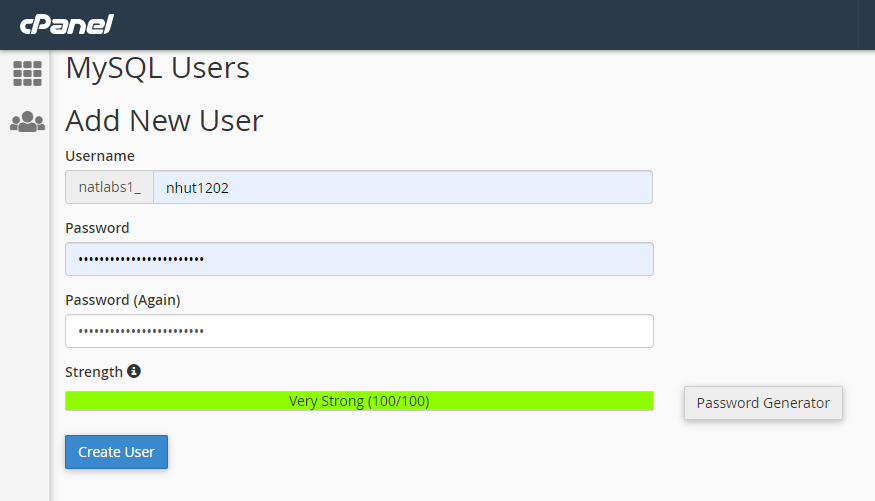
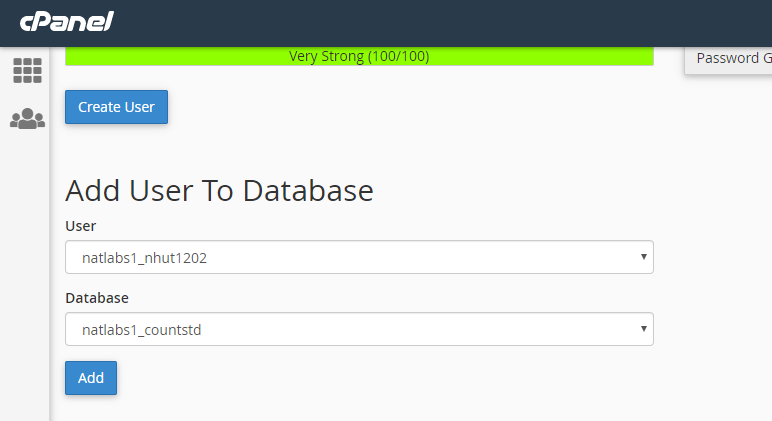

# HƯỚNG DẪN UPLOAD SOURCE CODE LÊN HOSTING CÁ NHÂN

- Hiện tại mã nguồn của hệ thống quản lý điểm danh đang được quản lý dưới tên tài khoản mặc định được tạo sẵn như sau:
  - Username: admin
  - Password: 123456
- Để bắt đầu upload source code lên hosting cá nhân trước hết phải đảm bảo người dùng đã có đủ 2 yếu tố là:
  - Hosting: là máy chủ sẽ chứa toàn bộ mã nguồn và đảm bảo đáp ứng kết nối từ phía người dùng. Ở hướng dẫn này sẽ dử dụng hosting là hawkhost.com. Đối với hosting cần có MySQL Databases.
  - Domain: là tên miền cho phép truy cập vào hệ thống máy chủ. Tên miền sử dụng trong hướng dẫn này là www.natlabs.net
- Khi đã có đủ các điều kiện cần thiết ta sẽ tiến hành upload theo các bước sau:
  - Đăng nhập vào cPanel của hosting bằng cách nhập url vào trình duyệt web với cú pháp: www.“your-domain”/cpanel. (VD: www.natlabs.net/cpanel )
  - Trình duyệt sẽ điều hướng đến trang đăng nhập như sau:

  

  - Sau khi đăng nhập thành công ta chọn File Manager để truy cập vào trình quản lý tệp tin của máy chủ như sau:
  
  

  - Ở giao diện File Manager ta nhấp chuột chọn nút Upload trên thanh công cụ, sau đó nhấp chọn nút Upload File và trỏ đến thư mục chưa tệp tin CheckinSource.zip và bấm Open. Sau đó chờ tệp tin được upload thành công vào hệ thống.
  - Quay lại giao diện File Manager nhấp chuột phải vào tệp tin CheckinSource.zip chọn Extract và chờ đến khi tệp tin được xả nén thành công. Ta sẽ thấy lúc này sẽ xuất hiện 2 thư mục mới có tên là “card_scanner” và “publish_html”. 
  
  

  - Như vậy là đã thành công upload sources code lên hệ thống cPanel của hosting.
- Quay lại giao diện chính của cPanel chọn MySQL Databases trong mục Database. Trình duyệt sẽ điều hướng đến trang quản lý cơ sở dữ liệu. 
  - Ta tạo 1 cơ sở dữ liệu mới tên “countstd” như hình và nhấp chuột vào nút Create Database.
  
  

  - Tiếp tục tạo User Database như hình bên dưới và nhấp nút Create User
  
  

  - Tiếp tục là liên kết User vừa tạo với Database đã tạo ở trên bằng cách chọn và nhấp chuột vào nút Add như hình:
  
  

- Sau khi đã hoàn tất các bước tạo cơ sở dữ liệu, ta quay lại giao diện File Manager nhấp chuột truy cập vào thư mục “card_scanner”. 
  - Nhấp chọn nút Setting ở góc trên bên trái của giao diện File Manager. Trong hộp thoại “Freferences”, tích chọn Show Hidden File sau đó nhấp chọn Save để lưu và đóng hộp thoại.
  
  

  - Trong thư mục “card_scanner” ta nhấp chọn chuột phải vào tệp tin .env và chọn Edit
  
  

  - Trong trang Edit tệp tin .env ta sửa lại các thông số liên quan đến Database ở dòng 12, 13, 14 lần lượt là Tên DB, User và Password vừa tạo ở trên. Sau đó nhấp chọn nút Save Change để lưu thay đổi.
  
  

- Quay lại giao diện chính của cPanel chọn mục phpMyAdmin. 
  - Trong giao diện phpMyAdmin chọn tên Database đã tạo ở danh sách DB phía bên trái, sau đó nhấp chọn nút Insert. Trong mục File to import nhấp chọn nút Choose File và trỏ đến file “countstd.sql” trên máy tính và nhấp chọn Open. 
  
  

  - Lăn cuộn chuột đến cuối trang và nhấp chọn nút Go để import cơ sở dữ liệu vào MySQL.
- Lúc này ta truy cập vào Domain đã đăng ký để truy cập vào trang đăng nhập của hệ thống điểm danh với tài khoản mặc định ở trên.
- Vậy là ta đã hoàn thành việc publish source code của hệ thống điểm danh lên hosting cá nhân thành công. Hệ thống server điểm danh đã sẵn sàng để sử dụng.
