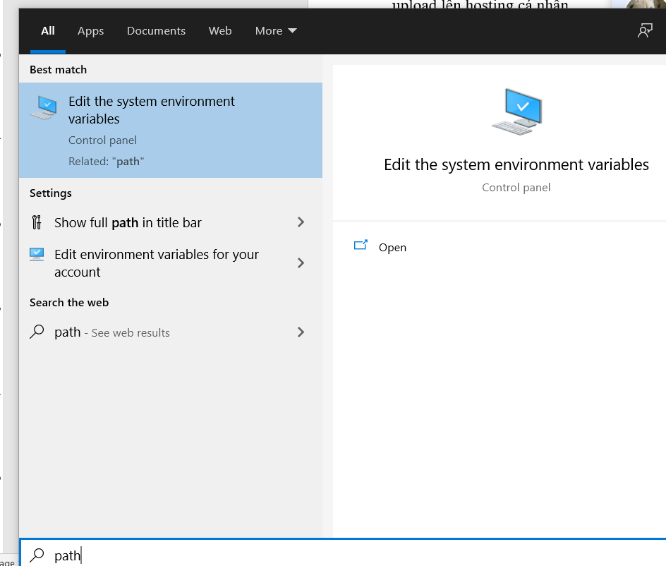

# HƯỚNG DẪN TẠO SERVER LOCAL

- Hai ứng dụng nền tảng cơ bản để dựng và chạy localhost trên máy tính cá nhân:

[Xampp](https://www.apachefriends.org/index.html)

[Git](https://git-scm.com/)

- **Bước 0:** Đưa php vào system path:

  - Nhấn phím windows, nhập “path” để tìm Edit the system environment variable:

  

  - Chọn Environment Variables:

  

  - Chọn path > Edit:

  

  - Chọn New, điền vào C:\xampp\php

  

  - Chọn OK để save lại.

- **Bước 1:** Giải nén file card_scanner.zip(\web_server\local\) và chép thư mục card_scanner vào thư mục C:\xampp\htdocs.
- **Bước 2:** Khởi động phần mềm Xampp để tạo môi trường cho Localhost. Nhấn Start cho Apache và MySQL.


- **Bước 3:** truy cập <http://localhost/phpmyadmin> để vào trang quản lý Database.
  - Tạo new database với tên countstd:

  

  - Import database có sẵn vào database vừa được tạo, chọn import:

  

  - Chọn Choose file và chọn vào file countstd.sql (\web_server\local\) > Bấm Go ở cuối trang

  

- **Bước 4:** Nếu muốn thay đổi database, truy cập vào tệp tin _DatabaseSeeder.php_ theo đường dẫn C:\xampp\htdocs\card_scanner\database\seeds. Thay đổi thông tin tài khoản đăng nhập mong muốn:

```python
class seedAdmin extends Seeder
{
    public function run()
    {
        DB::table('admin')->insert([
            ['taikhoan' => 'tên đăng nhập ở đây', 'password' => bcrypt('Mật khẩu ở đây')],
            ['taikhoan' => 'admin', 'password' => bcrypt('123456')],
        ]);
    }
}
```

- **Bước 5:** Mở cmd, gõ vào:

```bash
cd C:\xampp\htdocs\card_scanner
```

- **Bước 6:** Thực thi thay đổi cơ sở dữ liệu (nếu có):

```bash
php artisan db:seed
```

- **Bước 7:** Tiến hành chạy server:

```bash
php artisan serve --port=8000
```


- **Bước 8:** Truy cập _<http://localhost:8000>_ để truy cập hệ thống
