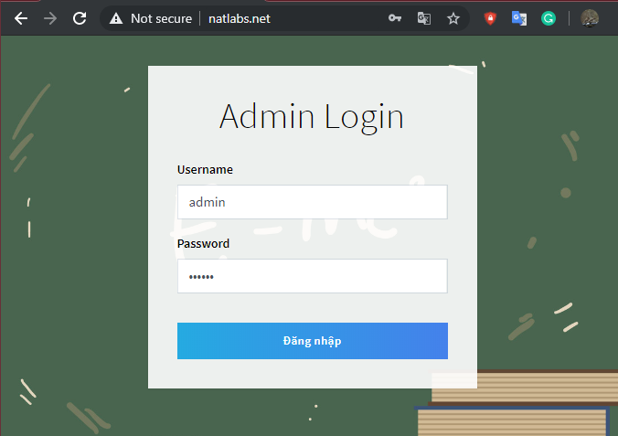
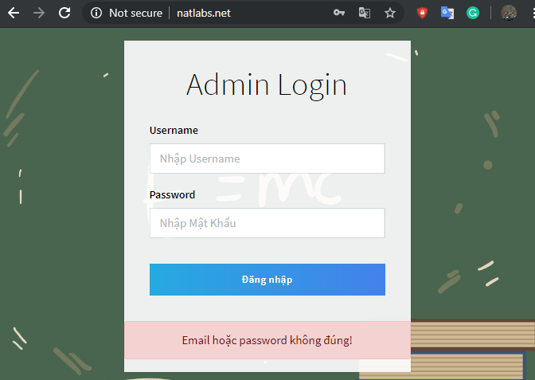
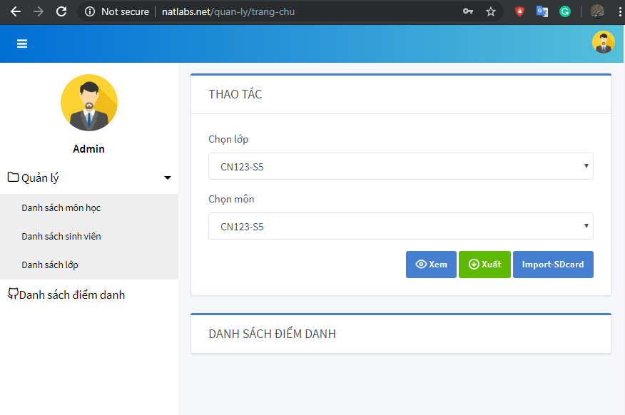
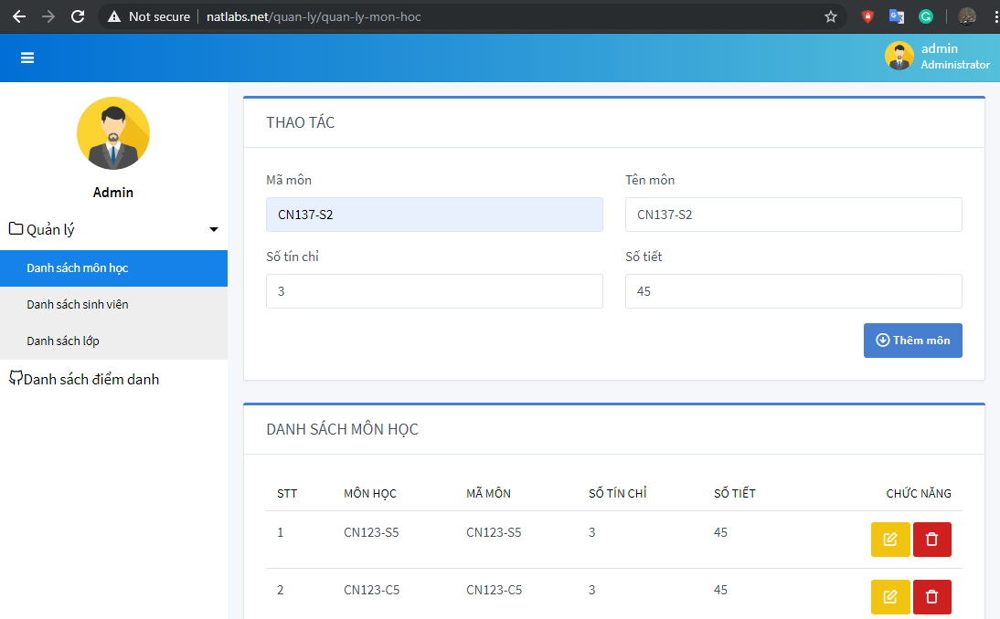
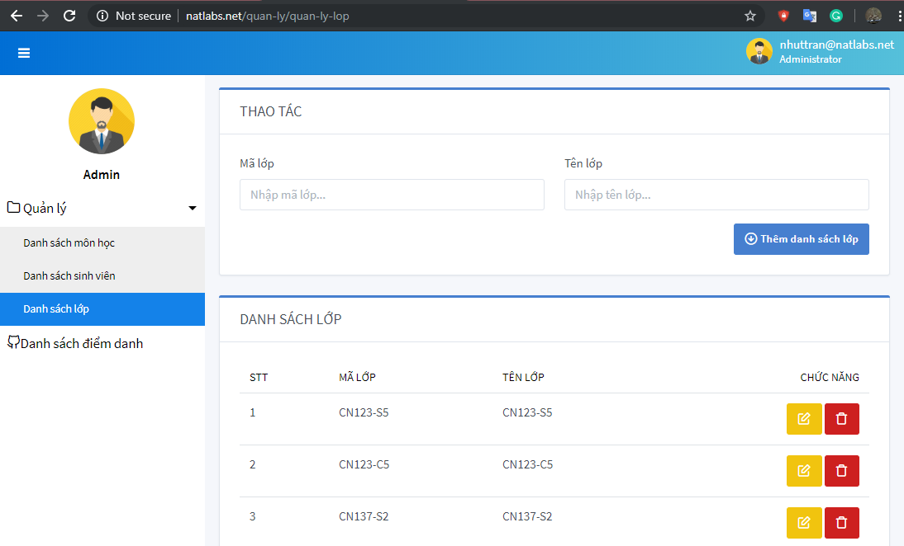
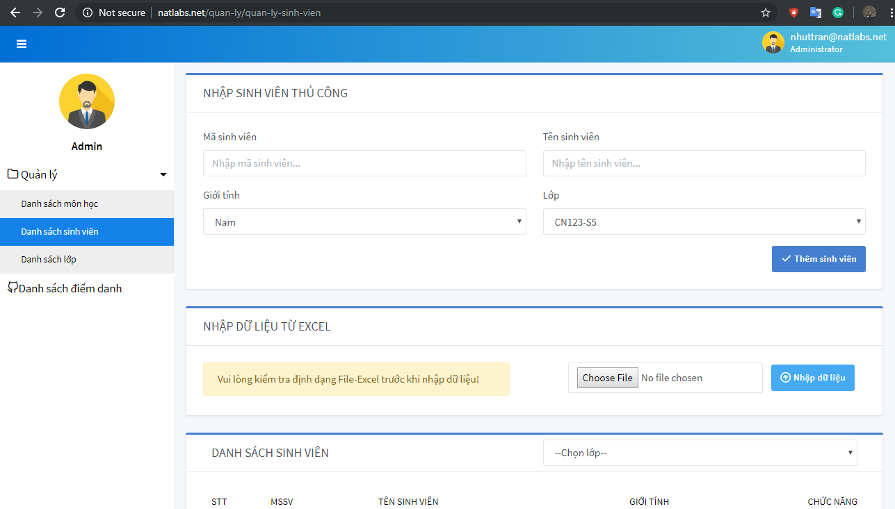
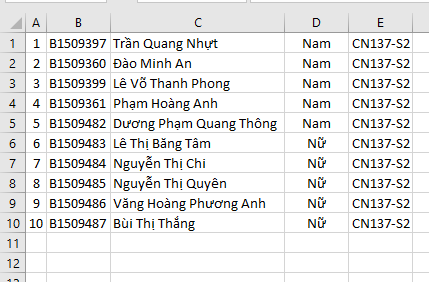
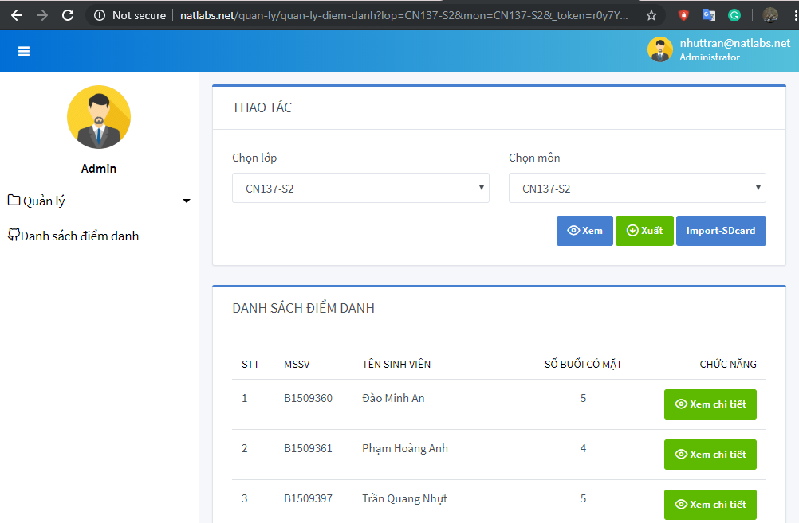
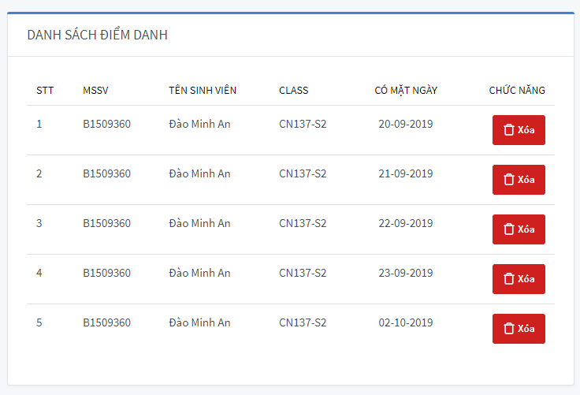
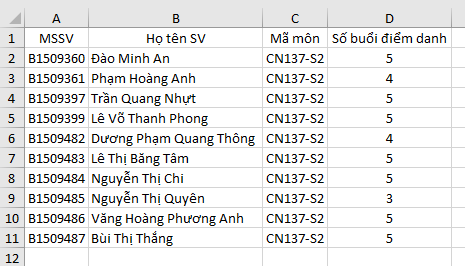

# HƯỚNG DẪN SỬ DỤNG HỆ THỐNG (ĐÃ CÀI ĐẶT)

- Người dùng sẽ sử dụng trình duyệt web để truy cập vào trang đăng nhập của hệ thống (localhost:2020 hoặc tên miền global nếu đã cập nhật lên server).

  

- Nhập tên đăng nhập và mật khẩu lần lượt vào ô Username và Password sau đó nhấp chuột chọn nút Đăng nhập (hoặc ấn Enter) để truy cập vào hệ thống.
- Trường hợp sai mật khẩu hoặc tên đăng nhập hệ thống sẽ thông báo như hình bên dưới. Ta tiến hành nhập lại đúng tài khoản sẽ đăng nhập được vào hệ thống.

  

- Sau khi đăng nhập thành công, ta sẽ truy cập vào trang chủ như sau:

  

- Để tạo một lớp học phần ta tiến hành lần lượt theo các bước sau:
  - Nhấp chuột chọn mục “Danh sách môn học” trong danh mục Quản lý ở Tab bên trái.

  

  - Nhập các thông tin của lớp học phần vào các ô tương ứng trong mục Thao tác. Ở đây đề xuất Mã môn học nhập theo nguyên tắc “Mã học phần – buổi học”. Lưu ý, thiết bị chỉ nhận Mã môn tối đa 8 ký tự. Cụ thể như “CN137-S2” là lớp học phần CN137 sáng thứ 2. (Tên môn nên đặt giống Mã môn để hiển thị ngắn gọn và đồng nhất ở mục Danh sách điểm danh). Số tín chỉ và Số tiết không được để trống nhưng không ảnh hưởng đến hệ thống.
  - Sau khi nhập đủ thông tin lớp học phần, nhấp chọn nút Thêm môn để kết thúc thao tác tạo lớp. Lớp vừa tạo sẽ xuất hiện trong mục Danh sách môn học bên dưới.
- Nhấp chọn danh mục Danh sách lớp trong Tab bên trái để mở giao diện danh sách lớp. Tiến hành nhập Mã lớp và Tên lớp vào 2 ô tương ứng trong khung Thao tác. Mã lớp ở đây phải trùng khớp với Mã môn đã tạo trong Danh sách môn học để liên kết dữ liệu 2 bảng. Xong thao tác nhập liệu ta nhấp chuột chọn nút Thêm danh sách lớp để kết thúc thêm lớp vào cơ sở dữ liệu.

  

- Ta nhấp chọn danh mục Danh sách sinh viên trong Tab bên trái để mở giao diện quản lý sinh viên. Trong danh mục Danh sách sinh viên sẽ có 3 mục chính là Nhập sinh viên thủ công, Nhập dữ liệu từ Excel và Danh sách sinh viên.
- Để nhập sinh viên thủ công ta nhập lần lượt mã số sinh viên và tên sinh viên vào ô tương ứng. Chọn Giới tính và Lớp bằng cách nhấp chuột vào icon mũi tên bên phải mỗi trường tương ứng. Sau đó nhấp nút Thêm sinh viên.

  

- Để nhập danh sách sinh viên từ File Excel, ta tạo dữ liệu Excel theo định dạng như hình dưới đây:

  

- File excel phải được định dạng gồm 5 cột. Cột A là số thứ tự, Cột B chứa Mã số sinh viên, Cột C chứ tên đầy đủ của sinh viên (có dấu hoặc không dấu – có thể chứa ký tự trống ở cuối nhưng không khuyến khích), Cột D là giới tính (Nam hoặc Nữ), Cột E chưa Mã lớp để liên kết với danh sách sinh viên tương ứng. File Excel có thể được lưu dưới tên bất kì.
- Nhấp chọn nút Choose File trong mục Nhập dữ liệu từ excel, trỏ tới đường dẫn chứa file excel trên máy tính và nhấn Open. Sau đó nhấp chọn nút Nhập dữ liệu. Khi nhập dữ liệu thành công ta có thể xem danh sách sinh viên ở mục Danh sách sinh viên bên dưới.
- Để xem danh sách sinh viên đã điểm danh, ta nhấp chọn danh mục Danh sách điểm danh ở Tab bên trái.

  

- Ta chọn lớp và môn tương ứng xong chọn nút Xem để xem danh sách đã điểm danh ở mục Danh sách điểm danh bên dưới. Hoặc nhấp chọn nút Xuất để tải về file excel chứa dữ liệu điểm danh tương ứng của lớp học phần đó.
- Muốn xem chi tiết điểm danh của một sinh viên, ta nhấp chọn nút Xem chi tiết ứng với mỗi tên sinh viên. Kết quả như hình bên dưới:

  

- Dữ liệu chi tiết chỉ cho phép xóa chứ không được chỉnh sửa thông tin. Ngày điểm danh được sinh ra từ thiết bị khi sinh viên quét thẻ điểm danh.
- File excel chứa dữ liệu điểm danh khi tải về máy sẽ thể hiện như sau:

  
